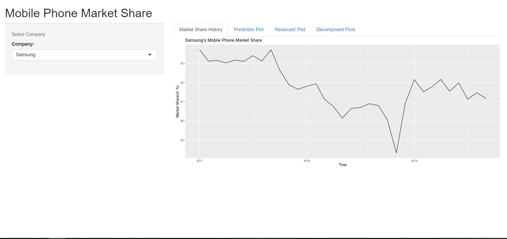
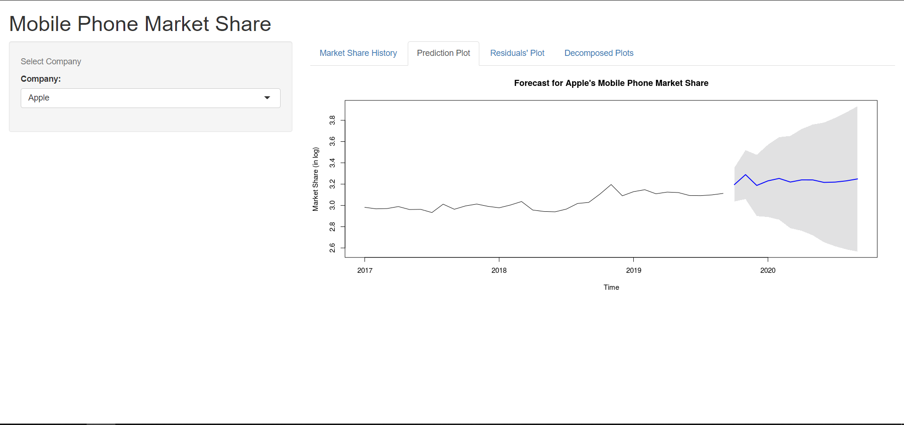
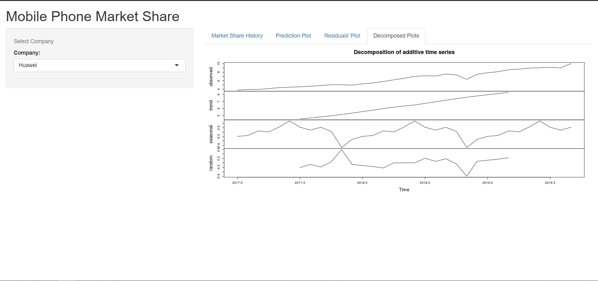
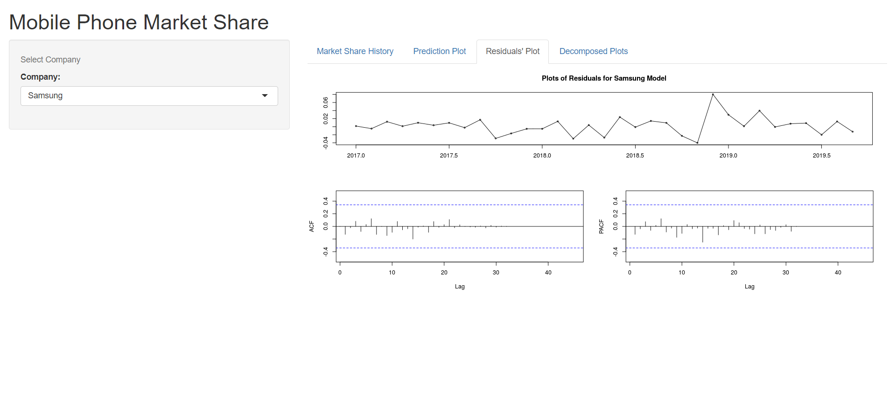

```{r setup, include=FALSE}
knitr::opts_chunk$set(echo = TRUE)
library(tidyverse)
library(tseries)
library(forecast)
library(ggplot2)
library(dplyr)
library(rfUtilities)
library(pastecs)
```

# Whole World In Your Hand

According to the Oxford English Dictionary, one of the earliest uses of the word *"mobile"* was in association with a Latin phrase _"mobile vulgus"_ meaning *"excitable crowd"*. Today, mobile phones live up to these origins. In the contemporary world, mobile phones are not just a rich man's accessory. It is transforming the way the world leads their day to day lives. There are estimates that by 2021 around 45% of the world's population is going to own a smartphone[1]. This means that mobile business is one of the most lucrative and competitive one with numerous vendors trying to grab a bigger share in the market. We became interested in analyzing the market share of companies and how they are projected to vary in the coming few months.

The data considered[2] includes the yearly worldwide market share of different manufacturers. Samsung is the leading vendor worldwide having the highest mobile phone market share in recent times with Apple in second place and Huwaei in the third position.

```{r echo = FALSE}
data <- read.csv("data.csv")
x = seq(as.Date("2017/1/1"), by = "month", length.out = 33)
data$Date <- x
df <- data %>%
  select(Samsung, Apple, Huawei, Date) %>%
  gather(key = "Company", value = "value", -Date)
df %>% ggplot(aes(x=Date, y = value)) + 
  geom_line(aes(color = Company)) +
  xlab('Year') +
  ylab('Market Share (in %)') + ggtitle("Mobile Phone Market Share of different Companies") + labs(caption = "Fig(1)")
```


Last year, Samsung was the leader in the mobile market with a market share of 31.37% at the end of the year. Apple being at second number with 24.79% and Huwaei coming in at 3rd place with 9.95%. It would be interesting to know how these numbers of market share for these 3 big companies might change in the coming few months.

# Exploring The Dataset

In our final data, we have  33 observations which are the market shares of 3 companies namely Samsung, Apple and Huawei. Samsung has been the global leader in the mobile phone market share with a mean of 31.8% since 2017. Samsung's market share for mobile phones saw a big dip in November of 2011 coming down to 28.34% which is the minimum share Samsung has gone since 2017. Apple with an average of 20.78% has been as a strong 2nd place in the race for market share for mobile phones with a maximum share being 24.44% at the same time when Samsung's share dipped. This could have been due to Apple's launch of iPhone models XS, XS Max and XR, which were extremely successful. Huawei has consistently stayed 3rd in the global leaders for mobile phone market share, with an average of 6.4% share since 2017 with a standard deviation of 1.9%. There are no missing or NA values in the dataset and we found no outliers worth discarding in the data (Appendix 1). Summary of the dataset and descriptive statistics can be found in Appendix 2.

```{r echo = FALSE}
desc_stat <- stat.desc(data)
is.num <- sapply(desc_stat, is.numeric)
desc_stat[is.num] <- lapply(desc_stat[is.num], round, 1)
desc_stat_t <- t(desc_stat)
colnames(desc_stat_t) <- rownames(desc_stat)
rownames(desc_stat_t) <- colnames(desc_stat)
desc_stat_t[c(2,3,4), c(4,5,6,8,9,13)]
```

We will be predicting the values of market share for the top 3 global leaders in the mobile phone market namely Samsung, Apple, Huwaei with the values from January 2016 to September 2019 as our training data and values from October 2019 to March 2020 as our test data. We will be coming out with a model with the best accuracy for each of the companies and then give final predictions for the next 6 months. We will be looking in detail on the process for Samsung.

```{r echo = FALSE}
##Samsung
data_samsung <- data %>% select(Samsung)
ts_data_samsung <- ts(data_samsung, start = c(2017,1), frequency = 12)
log_ts_data_samsung <- log(ts_data_samsung)
```

# Predicting Samsung's Market Share For Next Six Months

We will start with the analysis of Samsung's mobile phone market share. Decomposing the time series we can that there is a seasonal trend in the series from Fig(2). We will keep this in mind while making our model. This seasonal trend is possible as the market share is expected to change due to the launch of new models both by Samsung and by their competitors. These releases are mostly periodic. There is also a downward trend in the series with some random or unexplainable parts of the series.

```{r echo=FALSE, fig.height=5, fig.width=6}
#autoplot(ts_data_samsung) + ggtitle("Samsung Mobile Phone Market Share") + xlab("Year") +ylab("Market Share(in %)")
ts_demo_components <- decompose(ts_data_samsung)
plot(ts_demo_components)
title(sub = "Fig(2)")
```

## Stationarity

Primary assumption of ARIMA model is Stationarity. A time series is stationary when the mean and variance are constant over time[4]. There are tests which can determine whether a time series is stationary or not. We will be using the Augmented Dicky-Fuller Test to test the stationarity of the series which has the null hypothesis that a unit root is present in a time series sample. The alternative hypothesis is different depending on which version of the test is used, but is usually stationarity[5].

Looking at the test results (p-value = 0.8224), we can say that data does not pass the stationarity test. We will apply log transformation to the data and test the stationarity again. But, we see that the series is still not stationary (p-value = 0.8135).
The results of the two Dickey-Fuller tests can be seen in Appendix 3.

The next step to make the data stationary is by differencing the series. When we run the test with a difference of d = 2 on the log-transformed data, we get a p-value less than 0.01 which means that we can reject the null hypothesis and proceed with the alternate hypothesis (that the data is stationary). Now, we have a stationary time series at our hands which can be seen in Fig(3).

```{r echo=FALSE, message=FALSE, warning=FALSE}
##Samsung
ts_data_diff_samsung <- diff((log_ts_data_samsung), difference = 2)
adf.test(ts_data_diff_samsung, alternative = "stationary")
```
```{r echo = FALSE}
plot(ts_data_diff_samsung)
title(sub = "Fig(3)")
```

## Model

We move on to make our ARIMA model. We use auto.arima() function to get an initial model with default seasonal argument set to TRUE, so that seasonality of the series is also considered in the model and then tune the model with graphs of Autocorrelation and Lag (acf and pacf).  
```{r echo = FALSE}
##Samsung
fit_samsung <- auto.arima(log_ts_data_samsung, stepwise = FALSE, approximation = FALSE, d = 2)
fit_samsung
#acf(ts_data_diff_samsung)
#pacf(ts_data_diff_samsung)
```
The initial model given by auto.arima() is an ARIMA(1,2,4). We see that neither of the p and q values in the ARIMA(p,d,q) model is 0. Hence, the acf and pacf graphs won't give a conclusive value of p and q in this case[3]. Hence we move on with the model that auto.arima() gives us. From the ACF and PACF graphs of the residuals of the model (Appendix 5), we see that there are no spikes in any lags, hence we can move on to predicting the values saying the model seems decent enough. 


## Prediction

```{r include = FALSE, echo = FALSE}
test_data <- read.csv("test_data.csv")
##Samsung
futurVal_samsung_fit <- forecast(fit_samsung, h=6, level=c(99.5))
Point_Forecast <- exp(futurVal_samsung_fit$mean)
Lower_CI <- exp(futurVal_samsung_fit$lower)
Upper_CI <- exp(futurVal_samsung_fit$upper)
forecast <- cbind(Point_Forecast, Lower_CI, Upper_CI)
Original <- test_data$Samsung
compare <- cbind(Point_Forecast, Original)
compare
```

The test data consists of values from 2019-10 to 2020-03. We predict the values of same duration from our model. Looking at the side by side view of our forecast values and original values, we can say that they are quite close and the original values are well within the 99.5% CI of forecasted values, hence our model is justifiable. The accuracy of the model can be seen through the errors in the model. We can see that RMSE and MAPE are quite low for the model which can be seen in Appendix 4. 

```{r echo = FALSE}
final <- cbind(Original, Point_Forecast, Lower_CI, Upper_CI)
final
```

Now, we will use this model to predict the values for coming six months. 

```{r echo = FALSE}
futurVal_samsung_fit_2020 <- forecast(fit_samsung, h=12, level=c(99.5))
exp(futurVal_samsung_fit_2020$mean)
plot(futurVal_samsung_fit_2020)
```
Looking at the forecasted values and graph, we see an overall declining trend in this year for Samsung's market share in the mobile phone market. 

# Dashboard

The Dashboard is accessible online at : https://rproject718.shinyapps.io/try_shiny/

We have also created a DashBoard using RShiny. In the dashboard, it is possible to select the company (Samsung, Apple and Huawei) and an option to select analysis (Market Share History, Predictions, Residuals and Decomposition).  
Our dashboard comes with a prediction analysis of the chosen company. It gives the detailed decomposition graphs which show trends and seasoanilty of the series through which multiple things can been explored. It also shows the graphs of residuals through which one can see how good of a fit the model is to the data. The prediction plots show the curve of market share of company chosen till September 2020. It also shows the exisiting trends of each company's market share of mobile phones. This DashBoard can be useful during presentations where the presenter needs pictorial representation of the data rather than a full report.
The existing dashboards don't provide a full fledged analysis while they just act as a tool to visualize the existing or prediction data of these companies. There is generally no provision to see the seasonilty or trend componnents differently to visualize the time series. Also, they dont provide a visual to how good the fit of the model is. We aim to compensate all these in our dashboard.

Some visuals of the Dashboard are included in Appendix 8. 

# Conclusion and Future Work

The project analyzed the market share of the 3 largest mobile manufacturers in the world and their projected share for the coming six months using ARIMA model. The report outlines the process in detail for Samsung. 
We did a similar analysis for Apple. After differencing the data and achieving a stationary series, we run auto.arima() which gives a Seasonal Arima model with orders as (0,2,1)(0,1,0). We tune our p and q looking at the ACF and PACF graphs and obtain a model with orders (0,2,2).By looking at the errors and AIC values, we conclude that the model given by auto.arima() has less error and AIC value and hence we procede to predcit further values with that data. We see an increasing overall trend in Apple's Mobile Phone market share in second half of 2020. The full analysis can be found in Appendix 6.

Analysis of Huawei was also done. After differencing the data and achieving a stationary series, we run auto.arima() which gives an Arima model with orders as (2,2,0). We tune our p and q looking at the ACF and PACF graphs and obtain a model with orders (0,2,2). 
By looking at the errors and AIC values, we conclude that the model given by auto.arima() has less error and AIC value and hence we procede to predcit further values with that data. We see a strong increasing overall trend in Huawei's Mobile Phone market share in second half of 2020. The full analysis can be found in Appendix 7.

Time Series Analysis does not incorporate any external factors. For example, sales for some vendors may be affected more adversely by the ongoing coronavirus epidemic than others. But this model will not be able to incorporate such conditions. A possible extension to this project could be making a different prediction model that is robust to such external circumstances.

# References

[1] https://www.statista.com/topics/840/smartphones/

[2] https://gs.statcounter.com/vendor-market-share/mobile/worldwide

[3] https://otexts.com/fpp2/non-seasonal-arima.html

[4] https://towardsdatascience.com/time-series-forecasting-arima-models-7f221e9eee06

[5] https://en.wikipedia.org/wiki/Augmented_Dickey%E2%80%93Fuller_test


# Contributions

Both of us surveyed the data and made the models independently. After this, we split the companies for analysis. Post that, Rishabh focused more on compiling the report whereas Karanjot worked on making the dashboard.

# Appendix

## Appendix 1

```{r echo=FALSE, fig.height=3, fig.width=6, message=FALSE, warning=FALSE}
data %>% ggplot(aes(x = seq(Samsung), y = Samsung)) + geom_point() + ggtitle("Testing Outliers for Samsung")
data %>% ggplot(aes(x = seq(Apple), y = Apple)) + geom_point() + ggtitle("Testing Outliers for Apple")
data %>% ggplot(aes(x = seq(Huawei), y = Huawei)) + geom_point() + ggtitle("Testing Outliers for Huawei")
```

```{r echo = FALSE}
data %>% summarise_all(list(~sum(is.na(.))))
```

## Appendix 2

```{r echo = FALSE}
summary(data)
str(data)
```

## Appendix 3

```{r echo = FALSE}
adf.test(ts_data_samsung, alternative = "stationary")
adf.test(log(ts_data_samsung), alternative = "stationary")
```

## Appendix 4
```{r echo = FALSE}
accuracy_fit_samsung <- forecast::accuracy(Point_Forecast, test_data$Samsung)
accuracy_fit_samsung
```

## Appendix 5

```{r echo=FALSE}
tsdisplay(residuals(fit_samsung), lag.max=45)
title(sub = "Fig(4)")
```

## Appendix 6

```{r echo = FALSE}
##Apple
data_apple <- data %>% select(Apple)
ts_data_apple <- ts(data_apple, start = c(2017,1), frequency = 12)
adf.test(ts_data_apple, alternative = "stationary")
log_ts_data_apple <- log(ts_data_apple)
adf.test(log_ts_data_apple, alternative = "stationary")
#plot(ts_data_apple)

ts_demo_components_apple <- decompose(ts_data_apple)
plot(ts_demo_components_apple)

ts_data_diff_apple <- diff((log_ts_data_apple), difference = 2)
adf.test(ts_data_diff_apple, alternative = "stationary")
plot(ts_data_diff_apple)

fit_apple <- auto.arima(log_ts_data_apple, stepwise = FALSE, approximation = FALSE, d=2)
fit_apple
tsdisplay(residuals(fit_apple), lag.max=45)
acf(ts_data_diff_apple)
pacf(ts_data_diff_apple)
fit2_apple <- Arima(log_ts_data_apple, order = c(0,2,2))
fit2_apple

futurVal_apple_fit <- forecast(fit_apple, h=6, level=c(99.5))


futurVal_apple_fit2 <- forecast(fit2_apple, h=6, level=c(99.5))
pred_apple_fit2 <- exp(futurVal_apple_fit2$mean)

Point_Forecast_Apple <- exp(futurVal_apple_fit$mean)

accuracy_fit_apple <- forecast::accuracy(Point_Forecast_Apple, test_data$Apple)
accuracy_fit2_apple <- forecast::accuracy(pred_apple_fit2, test_data$Apple)
accuracy_fit_apple
accuracy_fit2_apple

Lower_CI_Apple <- exp(futurVal_apple_fit$lower)
Upper_CI_Apple <- exp(futurVal_apple_fit$upper)
Original_Apple <- test_data$Apple
cbind(Original_Apple, Point_Forecast_Apple, Lower_CI_Apple, Upper_CI_Apple)

futurVal_apple_fit_2020 <- forecast(fit_apple, h=12, level=c(99.5))
exp(futurVal_apple_fit_2020$mean)
plot(futurVal_apple_fit_2020)
```


## Appendix 7

```{r echo = FALSE}
##Huawei
data_huwaei <- data %>% select(Huawei)
ts_data_huawei <- ts(data_huwaei, start = c(2017,1), frequency = 12)
adf.test(ts_data_huawei, alternative = "stationary")
log_ts_data_huawei <- log(ts_data_huawei)
adf.test(log_ts_data_huawei, alternative = "stationary")
#plot(ts_data_huawei)

ts_demo_components_huawei <- decompose(ts_data_huawei)
plot(ts_demo_components_huawei)

ts_data_diff_huawei <- diff((log_ts_data_huawei), difference = 2)
adf.test(ts_data_diff_huawei, alternative = "stationary")
plot(ts_data_diff_huawei)

fit_huawei <- auto.arima(log_ts_data_huawei, stepwise = FALSE, approximation = FALSE, d = 2)
fit_huawei
#tsdisplay(residuals(fit), lag.max=45)
acf(ts_data_diff_huawei)
pacf(ts_data_diff_huawei)
fit2_huawei <- Arima(log_ts_data_huawei, order = c(0,2,2))
fit2_huawei
#tsdisplay(residuals(fit2), lag.max=45)

#Huawei
futurVal_huawei_fit <- forecast(fit_huawei, h=6, level=c(99.5))

futurVal_huawei_fit2 <- forecast(fit2_huawei, h=6, level=c(99.5))
pred_huawei_fit2 <- exp(futurVal_huawei_fit2$mean)

Point_Forecast_Huawei <- exp(futurVal_huawei_fit$mean)

accuracy_fit_huawei <- forecast::accuracy(Point_Forecast_Huawei, test_data$Apple)
accuracy_fit2_huawei <- forecast::accuracy(pred_huawei_fit2, test_data$Apple)
accuracy_fit_huawei
accuracy_fit2_huawei


Lower_CI_Huawei <- exp(futurVal_huawei_fit$lower)
Upper_CI_Huawei <- exp(futurVal_huawei_fit$upper)
Original_Huawei <- test_data$Huawei
cbind(Original_Huawei, Point_Forecast_Huawei, Lower_CI_Huawei, Upper_CI_Huawei)

##Huawei
futurVal_huawei_fit_2020 <- forecast(fit_huawei, h=12, level=c(99.5))
exp(futurVal_huawei_fit_2020$mean)
plot(futurVal_huawei_fit_2020)
```

## Appendix 8









